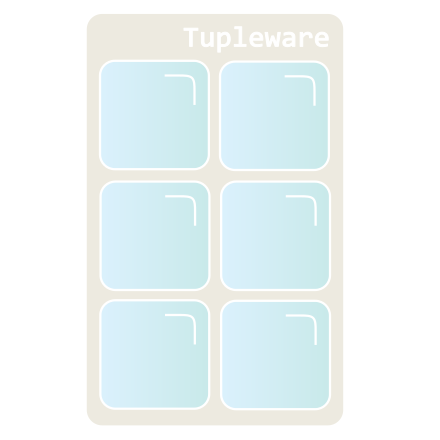

Tupleware
===



Tupleware is a small library which provides simple tuples for Java 11 and above.
Tuples are containers that hold a fixed sequence of strongly-typed elements e.g. a simple 'triple' tuple might
hold a commercial product name, a quantity and a price, like so:
```java
// This is a Tuple3<String, Integer, Double>
var cone = Tuple3.of("Ice cream cone", 1, 1.99);
```
Or a 'pair' tuple might look like this:
```java
// This is a Tuple2<String, Integer>
var customerOrder = Tuple2.of("Coffee", 2);
```
Tupleware gives you strongly typed access to the elements of a tuple:
```java
String name  = cone.elem1();
int quantity = cone.elem2();
double price = cone.elem3();
```
it lets you build new tuples by transforming old ones:
```java
var coneWithReducedPrice = cone.withElem3(1.50);
//  == Tuple3.of("Ice cream cone", 1, 1.50)
```
```java
var coneWithToppings = cone.append(List.of("Toffee Sauce", "Wafer"));
// == Tuple4.of("Ice cream cone", 1, 1.99, List.of("Toffee Sauce", "Wafer"))
```
and lots more besides. See the [User Manual](docs/UserManual.md) for extensive examples.

Requirements & limitations.
===
* The library requires Java 11 or higher.
* The library supports Tuples with 0 to 10 elements. (10 is an arbitrary limit which could be increased in the future.)

Design goals
===
* Immutability.
  * The tuples provided by this library are immutable.
  * Of course, the library cannot guarantee that what you keep in your tuples is immutable. That's up to you.
* Type safety.
  * We want to support users who believe in strongly typed designs.
* Use the compiler.
  * We want to catch as many errors as possible in the compilation phase rather than at runtime.
  * e.g. `Tuple7` has methods `Tuple7.concat(Tuple1)` up to `Tuple7.concat(Tuple3)`. In this way, the compiler
    prevents you from exceeding the Tupleware size limit of 10 elements.
* No external dependencies. We want the library to be as small as possible and easy to integrate.
* Note: Tuple element indices are 1-based, not 0-based. This is an arbitrary design choice, which probably comes
  from Scala's tuple syntax: `tuple._1`.

Tuples vs Java records
===
Java has had record types since Java 16, which are quite similar to tuples. When should we use tuples and when
should we use records?
```java
record Product(String name, int quantity, double price) {}
```

Records are 'named tuples', which means that the record itself and each element within it is a named field.
So records are real Java classes in the software design sense. They represent something fixed in your application type
system.

Tuples on the other hand are not named like this. A `Tuple2` is a generic 'pair' type & a `Tuple3` is a generic
'triple' type. Their elements _are_ strongly typed (like records' fields), but
the elements can only be referred to by their index. So tuples are a container you use to pass some data around but
instances are not likely to be long-lived in your application.

When we are dealing with types where the element names are known and fixed, Java records are better. For example,
small data classes representing domain objects are probably best modelled as records.

But when you have a small (10 elements or fewer) group of data objects that you want to pass from one method to
another, a tuple may be just what you need.