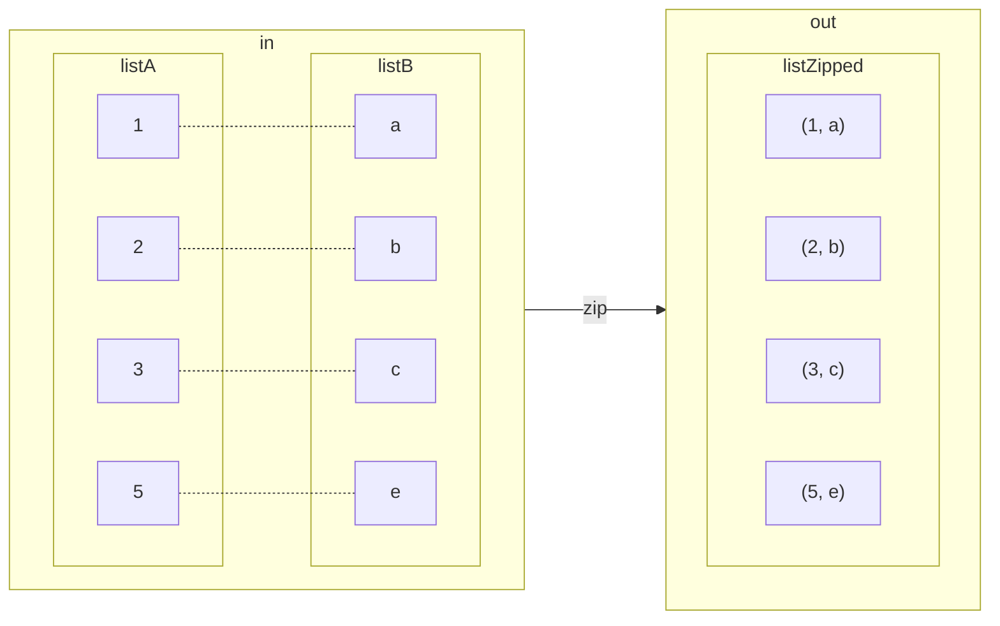

# Tupleware Usage Examples Manual

## Creating tuples
For Tuples of size 0 to 10, you can construct a tuple using an `of` method as follows:
```java
Tuple2<String, Integer> productAndQuantity = Tuple2.of("Coffee", 1);
```
There are also `ofNonNull` methods which will throw a `NullPointerException` if any of the provided
elements are null.

This code is perfectly readable for tuples with less than about 4 elements, but for larger tuples it can
become quite verbose and in such cases we recommend using Java's local variable type inference if possible.
There is no loss of type safety when using type inference.
```java
var productData = Tuple5.of("Apple pie", 1, 2.99, List.of("Cream", "Sugar"), 3.00);
```

`Tuple2` instances can also be created directly from a `java.util.Map.Entry<K, V>`:
```java
Map.Entry<String, Integer> mapEntry = // initialised somewhere else.
Tuple2<String, Integer> t2 = Tuple2.from(mapEntry);
```

## Accessing tuple elements
Tuple elements can be retrieved using an `elemN` method.

```java
var productData = Tuple5.of("Apple pie", 1, 2.99, List.of("Cream", "Sugar"), 3.00);

String       name     = productData.elem1();
int          quantity = productData.elem2();
double       price    = produceData.elem3();
List<String> toppings = productData.elem4();
```
> **Note:** elements are indexed starting at 1, not 0.

> **Note:** there is no method like `elem(int index)`, as that would mean the loss of
  type safety. How would the compiler know what type the result of `elem(3)` had?

## Checking for null elements
All tuples have a method `containsAnyNulls()` which will return `true` if any element is `null`.
```java
var listWithNull = new ArrayList<String>();
listWithNull.add("Cream");
listWithNull.add(null);

Tuple4.of("Apple pie", 1, 2.99, listWithNull).containsAnyNulls() // == false. The elements are all non-null.

String name = null;
Tuple4.of(name, 1, 2.99, List.of("Milk")).containsAnyNulls() // == true. The first element is null.
```
> **Note:** Java's `List.of()` methods do not accept `null` arguments.

## Changing an element value
Tupleware tuples are immutable and so you cannot give a particular element a new value. Neither can you add or remove
elements from a tuple. However, both of these changes can be achieved by creating new tuple instances from old ones:

Creating a new tuple with new, fixed values for particular elements:
```java
var fixedPriceReduction = Tuple3.of("Ice cream cone", 1, 1.99)
                                .withElem2(2);
                                .withElem3(1.50);
// == Tuple3.of("Ice cream cone", 2, 1.50)
```
or a new tuple whose element values are based on the previous values:
```java
var percentageReduction = Tuple3.of("Ice cream cone", 1, 1.99)
                                .mapElem3(price -> price * 0.75);
// == Tuple3.of("Ice cream cone", 1, 1.4925)
// You don't use floating point types for currency, right?
```

## Reversing a tuple
You can reverse any tuple like so:
```java
Tuple3<Double, Integer, String> reversed = Tuple3.of("Ice cream cone", 1, 1.99).reverse();
// == Tuple3.of(1.99, 1, "Ice cream cone")
```
Pairs also have a `swap` method which does the same thing:
```java
Tuple2<Integer, String> swapped = Tuple2.of("Ice cream cone", 1).swap();
// == Tuple2.of(1, "Ice cream cone")
```

## Adding new elements to a tuple

You can add new elements to the beginning or end of a tuple like so
```java
Tuple2<String, Integer> nameAndNumber = Tuple1.of("Coffee").append(3);
// == Tuple2.of("Coffee", 3)

Tuple3<Boolean, String, Integer> paidNameAndNumber = nameAndNumber.prepend(true);
// == Tuple3.of(true, "Coffee", 3)
```

## Splitting tuples
Tuples can be split into two smaller tuples like so (we leave the full types in here to demonstrate):
```java
var personalInfo = Tuple4.of("Mary", "Beery", List.of("Cakes", "Pastries"), Set.of("Coffee", "Tea"));

Tuple2<Tuple2<String, String>, Tuple2<List<String>, Set<String>>> namesAndFavourites =
                                                                  personalInfo.splitAfterElement2();
// == Tuple2.of(
//      Tuple2.of("Mary", "Beery"),
//      Tuple2.of(List.of("Cakes", "Pastries"), Set.of("Coffee", "Tea"))
//    )

Tuple2<String, String> names = nameAndFavourites.elem1();
// == Tuple2.of("Mary", "Beery")
    
Tuple2<List<String, Set<String>>> favourites = nameAndFavourites.elem2();
// == Tuple2.of(List.of("Cakes", "Pastries"), Set.of("Coffee", "Tea"))

String firstName = names.elem1();
// == "Mary"
Set<String> favouriteDrinks = favourites.elem2();
// == Set.of("Coffee", "Tea")
```

## Concatenating tuples
Tuples can also be concatenated, although it isn't possible to have a tuple with more than 10 elements.
> **Note:** any attempt to exceed the element limit _will not compile_.
```java
var names      = Tuple2.of("Mary", "Beery");
var favourites = Tuple2.of(List.of("Cakes", "Pastries"), Set.of("Coffee", "Tea"));

var combined = names.concat(favourites);
// == Tuple4.of("Mary", "Beery", List.of("Cakes", "Pastries"), Set.of("Coffee", "Tea"))
```

## Removing elements from tuples
> Remember: tuples are immutable, so this will create a new tuple that is smaller.

An element can be removed from a tuple as follows:
```java
var order = Tuple3.of("Coffee", 2, 1.99);
var orderWithoutQuantity = order.dropElem2();
// == Tuple2.of("Coffee", 1.99)
```

Just be careful when chaining a set of `dropElem` methods that you are removing the elements you think you are.
```java
var data = Tuple4.of(1, MONDAY, JANUARY, 1.0);

var data2 = data.dropElem2()
                .dropElem3();
// == Tuple2.of(1, JANUARY).
```

TODO take, drop [Right]

TODO note on deep equals.

## Zipping and unzipping tuples


It is a common operation to have two lists `List<A>` and `List<B>` and to want to 'zip' them up into a
`List<Tuple2<A, B>>`.  Likewise it can be useful to do the exact opposite: 'unzip' a `List<Tuple2<A, B>>` into 2 lists
`List<A>` and `List<B>`.

> If you're not familiar with the zip operation, think of a zip on a jacket. You have 2 'lists' of teeth on either side
> of the zip, and after zipping it up you have one list of pairs. Sort of.

This is quite easy with Tupleware:
```java
var listA = List.of(1, 2, 3, 5);
var listB = List.of('a', 'b', 'c', 'e');

var zip = Tuple2.zip(listA, listB);
// == List (
//      Tuple2.of(1, 'a'),
//      Tuple2.of(2, 'b'),
//      Tuple2.of(3, 'c'),
//      Tuple2.of(5, 'e')
//    )
```

> **Note:** if the lists are mismatched (not the same length), the zip will stop when no more pairs can be created. No
> exceptions will be thrown.

```java
var listA = List.of(1, 2);
var listB = List.of('a', 'b', 'c');

var zip = Tuple2.zip(listA, listB);
// == List (
//      Tuple2.of(1, 'a'),
//      Tuple2.of(2, 'b')
//    )
```

Unzipping is just the opposite procedure:
```java
var zipped = List.of(Tuple2.of(1, 'a'), Tuple2.of(26, 'z'));
Tuple2<Integer, Character> unzipped = Tuple2.unzip(zipped);
```

For tuples with more than 2 elements, zipping and unzipping work exactly the same way. However the jacket zip
analogy doesn't really work for more than 2 elements.